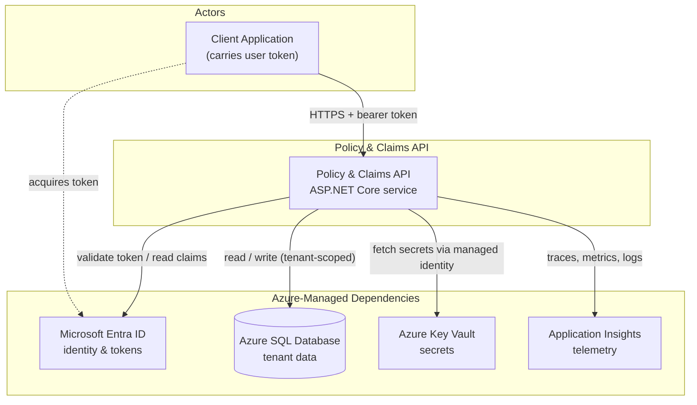
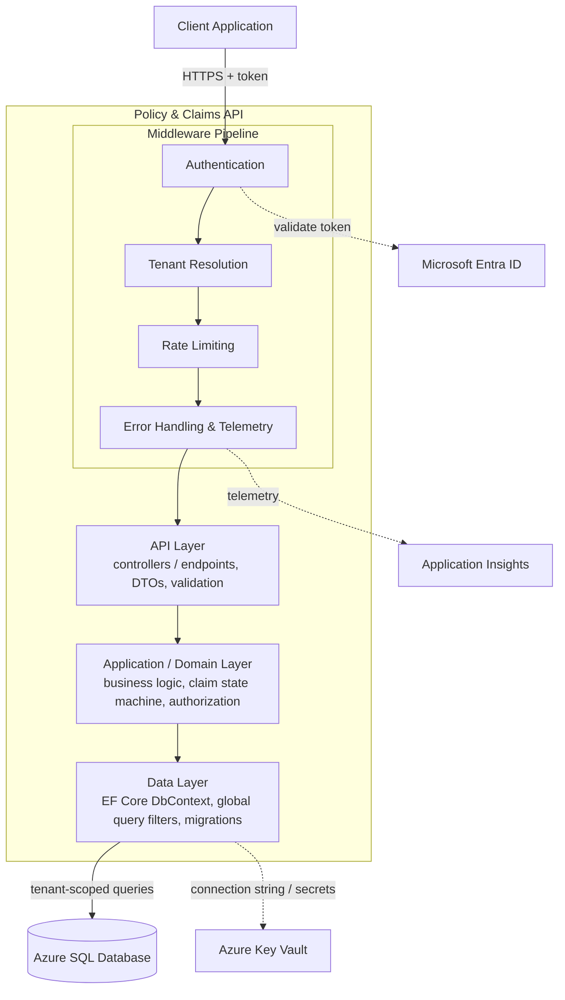
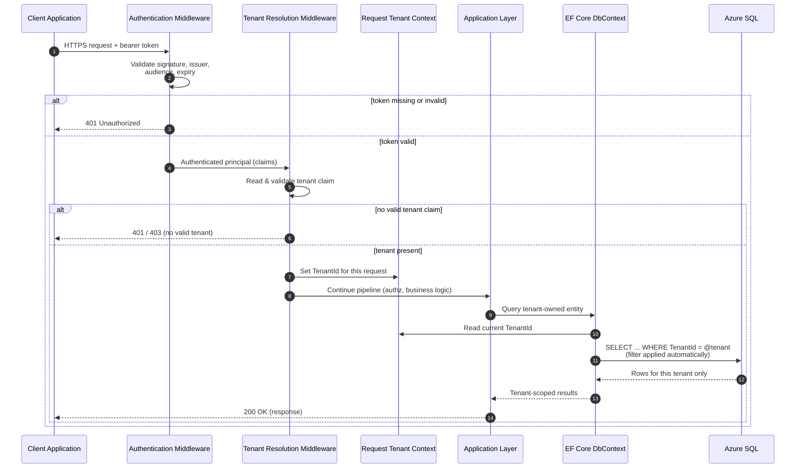
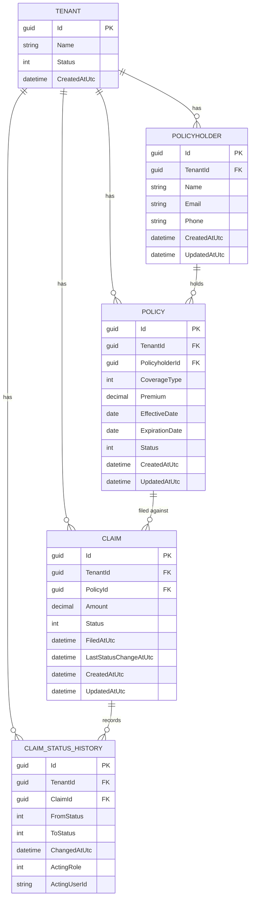
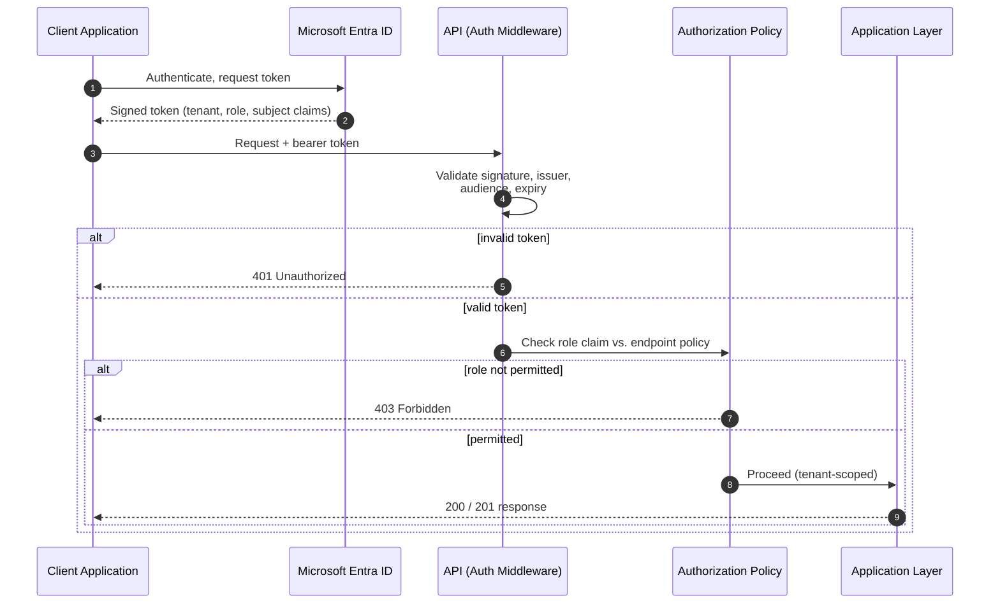
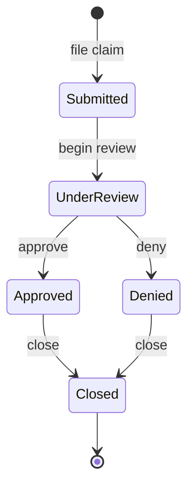
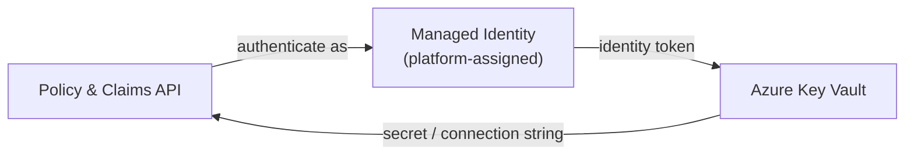
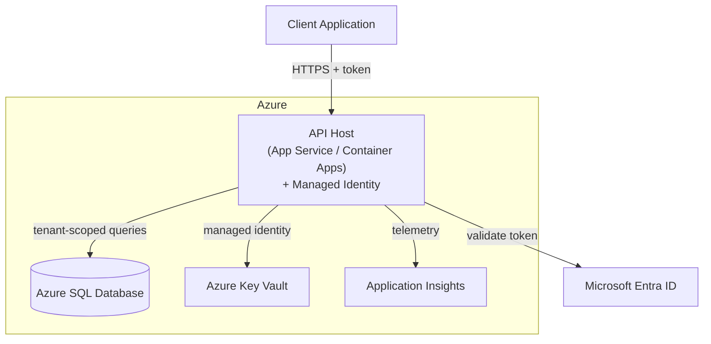

# Policy and Claims API — Design Document

**Author:** Luke Holder

---

## 1. Introduction

### 1.1 Purpose

This document describes *how* the Policy & Claims API is built. Where the Requirements Specification Document (RSD) defines what the system must do and the constraints it operates under, this design document translates those requirements into concrete architecture, data structures, interfaces, and behaviors. It is intended to be read alongside the RSD; requirement identifiers (e.g., FR-2.1, NFR-1.1) are referenced throughout so that each design decision traces back to the need it satisfies.

### 1.2 Scope of This Document

This document covers the architecture, technology choices, multi-tenancy strategy, data model, API surface, authentication and authorization design, claim workflow, cross-cutting concerns, deployment topology, testing strategy, and the rationale behind key design decisions. It does not restate the full requirements; it assumes familiarity with the RSD.

### 1.3 Intended Audience

The primary audience is the developer implementing the system. Secondarily, it serves as a portfolio artifact demonstrating architectural reasoning to reviewers and interviewers, and as a reference for anyone evaluating how the system's requirements were realized in practice.

### 1.4 Problem Recap

Insurance agencies need a secure, reliable way to manage policies and process the claims filed against them. A single service serving multiple agencies must keep each agency's data strictly isolated, enforce role-appropriate access for different staff, and move claims through a consistent, auditable workflow. The design that follows addresses these needs as a cloud-native, multi-tenant service on Azure, with tenant isolation, identity, secret management, and observability treated as first-class architectural concerns rather than afterthoughts.

### 1.5 How to Read This Document

Sections 2 and 3 establish the big picture — the architecture and the technology stack. Sections 4 through 8 drill into the areas that carry the most design risk: multi-tenancy, the data model, the API surface, identity, and the claim workflow. Section 9 covers cross-cutting concerns, Section 10 covers deployment, Section 11 covers testing, and Section 12 records the key design decisions and the trade-offs behind them.

---

## 2. Architecture Overview

### 2.1 Architectural Style

The system is a single, stateless RESTful web service built with ASP.NET Core, organized into clear internal layers and deployed as one unit to Azure. It follows a layered (onion-style) architecture that separates the HTTP surface from business logic and from data access, so that each concern can evolve and be tested independently (NFR-6.1). The service is stateless (NFR-5.2): no session state is held in-process, so any instance can serve any request and instances can be scaled horizontally without session affinity.

A single deployment serves all tenants (agencies). Tenant isolation is achieved logically, within a shared database, rather than by running separate deployments or databases per tenant. This choice is central to the design and is examined in detail in Section 4.

### 2.2 Layers and Responsibilities

The solution is divided into three primary layers, plus a cross-cutting middleware pipeline that every request passes through.

- **API layer** — ASP.NET Core controllers (or minimal API endpoints) that handle HTTP concerns: routing, model binding, input validation, serialization, and mapping between transport-level DTOs and the application layer. This layer contains no business rules.
- **Application / domain layer** — the business logic: policy and claim operations, the claim state machine, authorization decisions beyond simple role checks, and orchestration of data access. Domain entities and the rules that govern them live here.
- **Data layer** — Entity Framework Core `DbContext`, entity configurations, migrations, and the global query filters that enforce tenant isolation at the point of data access (NFR-1.1). This layer is the last line of defense for isolation.
- **Cross-cutting middleware** — authentication, tenant resolution, exception handling, rate limiting, and telemetry. These run as part of the request pipeline and apply uniformly across endpoints.

Dependencies point inward: the API layer depends on the application layer, which depends on abstractions the data layer implements. Business logic does not depend on ASP.NET Core or EF Core types directly, which keeps it testable in isolation.

### 2.3 Request Lifecycle

A typical authenticated request flows through the system as follows:

1. **TLS termination and routing** — the request arrives over HTTPS (NFR-2.3) and is routed to the API pipeline.
2. **Authentication** — the Entra ID–issued bearer token is validated (signature, issuer, audience, expiry). Requests with missing, expired, or invalid tokens are rejected before reaching business logic (FR-2.1, FR-2.2).
3. **Tenant resolution** — the tenant identifier is extracted from the validated token's claims and placed into a per-request tenant context. A request that cannot be bound to a valid tenant is rejected (FR-1.2, FR-1.3).
4. **Rate limiting** — the request is checked against the tenant's rate-limit partition; requests exceeding the limit receive a standard "too many requests" response (NFR-4.1, NFR-4.2).
5. **Authorization** — the user's role, read from token claims, is checked against the operation's requirements per the permission matrix (FR-2.4, FR-2.5).
6. **Business logic** — the application layer executes the operation, invoking the data layer as needed.
7. **Data access** — EF Core applies the active tenant's global query filter automatically to every read and write of tenant-owned entities, so isolation holds even if a query omits an explicit tenant clause (NFR-1.1, NFR-1.3).
8. **Response and telemetry** — the response is serialized and returned; request telemetry, tagged with tenant context, is emitted to Application Insights (NFR-3.1, NFR-3.2). Unhandled errors are converted to safe responses that do not leak internal detail (NFR-2.5).

### 2.4 External Dependencies

The service depends on several Azure-managed components at runtime (AC-4.1):

- **Microsoft Entra ID** — issues and signs the tokens the API validates; the source of user identity, tenant, and role claims.
- **Azure SQL Database** — the system of record for all tenant business data.
- **Azure Key Vault** — stores secrets and connection strings, accessed via a managed identity so that no secrets live in configuration or source (NFR-2.1, NFR-2.2).
- **Application Insights** — receives traces, metrics, and structured logs for observability (NFR-3.1, NFR-3.4).

### 2.5 System Context Diagram (C4 Level 1)

*The diagram below shows the API as a single system, the human and machine actors that interact with it, and the Azure services it depends on. It establishes the system boundary and its external relationships.*



### 2.6 Component Diagram (C4 Level 2–3)

*The diagram below looks inside the API, showing the internal layers, the cross-cutting middleware every request passes through, and how those components connect to the external dependencies.*



---

## 3. Technology Stack and Rationale

Each technology below is fixed by the RSD's technical constraints (AC-2.x). This section records *why* each is a sound fit and what the main alternative was, so the choices can be defended rather than merely stated.

### 3.1 Runtime and Framework — ASP.NET Core (C#)

ASP.NET Core is the framework the project targets (AC-2.1). It is a mature, cross-platform, high-performance framework for building REST APIs, with first-class support for dependency injection, a composable middleware pipeline (which the tenant-resolution, rate-limiting, and telemetry concerns rely on), built-in authentication/authorization primitives, and native integration with the rest of the Azure and Entra ID ecosystem. It also aligns directly with the target role's stack.

*Alternative considered:* a Node.js/Express or Java/Spring Boot service. Both are capable, but ASP.NET Core's tight integration with Entra ID, Key Vault, and Application Insights reduces custom glue code, and C#/.NET is the deliberate focus of this project.

### 3.2 Data Access — Entity Framework Core

EF Core is the mandated data-access technology (AC-2.2). Beyond standard ORM productivity, it provides two features this design leans on heavily: **global query filters**, which let tenant isolation be enforced automatically at the data-access layer for every tenant-owned entity (NFR-1.1, NFR-1.3), and **migrations**, which give versioned, repeatable schema evolution (NFR-6.2). Its `SaveChanges` interception points also allow automatic stamping of the tenant identifier and audit timestamps on write.

*Alternative considered:* a micro-ORM such as Dapper. Dapper offers finer control and raw performance, but it would require isolation to be enforced by hand in every query — exactly the fragile, easy-to-forget pattern that NFR-1.1 exists to avoid. EF Core's centralized enforcement is the safer fit for a multi-tenant system.

### 3.3 Data Store — Azure SQL Database

Azure SQL Database is the required data store (AC-2.3). It is a managed relational database, which suits the strongly relational domain (tenants, policyholders, policies, claims, and claim history form clear one-to-many relationships with referential-integrity needs — DR-4.x, DR-5.3). Being managed, it removes patching and backup overhead, offers a low-cost tier suitable for a portfolio project (AC-3.3), and integrates cleanly with managed identity for secret-free connection.

*Alternative considered:* a NoSQL store such as Cosmos DB. The domain's relational shape and integrity constraints make a relational database the more natural and honest fit; Cosmos would add modeling friction without a corresponding benefit at this scale.

### 3.4 Identity — Microsoft Entra ID

Entra ID is the required identity provider (AC-2.4). Delegating authentication to Entra ID means the service never handles credentials or authentication flows itself (AC-1.2); it validates signed tokens and reads the tenant and role claims it needs (FR-2.1, FR-2.3). This offloads a large, security-sensitive surface to a hardened managed provider and provides the claims-based foundation for both tenant resolution and role-based authorization.

*Alternative considered:* self-managed authentication (e.g., hand-rolled JWT issuance with a local user/password store). This would mean owning credential storage, hashing, rotation, and reset flows — significant risk and effort for no benefit, and contrary to the design goal of keeping identity external.

### 3.5 Secret Management — Azure Key Vault with Managed Identity

Key Vault stores secrets and connection strings, and a managed identity grants the service access to them (AC-2.5). Together they satisfy the requirement that no secrets appear in configuration or source (NFR-2.1, NFR-2.2): at startup the service authenticates to Key Vault using its Azure-assigned identity — no secret needed to fetch secrets — and retrieves what it needs at runtime. This eliminates the most common class of credential leak (secrets committed to source control).

*Alternative considered:* environment variables or configuration files holding secrets. Simpler to set up, but it reintroduces exactly the leak risk NFR-2.1 forbids, and it does not demonstrate the secret-free pattern that is a core objective of the project.

### 3.6 Observability — Application Insights

Application Insights is the required telemetry service (AC-2.6). It provides distributed tracing, request/dependency metrics, and structured logging out of the box, and integrates with ASP.NET Core with minimal code. Telemetry can be enriched with tenant context so that behavior and performance can be analyzed per tenant without logging sensitive data (NFR-3.1, NFR-3.2), and it backs the latency observability the performance targets rely on (NFR-4.3).

*Alternative considered:* a self-hosted stack (e.g., Prometheus/Grafana with a logging backend). Powerful and portable, but operationally heavy for a single-developer portfolio project (AC-3.1) and redundant given Application Insights' native Azure integration.

### 3.7 Hosting and Deployment

The service targets Azure's managed platform (AC-2.7, NFR-7.1) and is deployed as a stateless unit, allowing horizontal scale (NFR-5.2). The specific hosting option (e.g., Azure App Service versus Azure Container Apps) and the CI/CD and infrastructure-as-code approach are detailed in Section 10; the relevant point here is that every runtime dependency is an Azure-managed service, keeping operational burden and cost low (AC-3.1, AC-3.3) and enabling repeatable provisioning as a stretch objective (NFR-7.2).

### 3.8 Stack Summary

| Concern | Technology | Primary requirement(s) |
|---|---|---|
| Runtime / framework | ASP.NET Core (C#) | AC-2.1, NFR-6.1 |
| Data access | Entity Framework Core | AC-2.2, NFR-1.1, NFR-6.2 |
| Data store | Azure SQL Database | AC-2.3, DR-4.x, DR-5.3 |
| Identity | Microsoft Entra ID | AC-2.4, FR-2.1, FR-2.3 |
| Secret management | Azure Key Vault + Managed Identity | AC-2.5, NFR-2.1, NFR-2.2 |
| Observability | Application Insights | AC-2.6, NFR-3.1, NFR-3.2 |
| Hosting | Azure managed platform | AC-2.7, NFR-7.1, NFR-5.2 |
---

## 4. Multi-Tenancy Design

Multi-tenancy is the defining architectural concern of this system. A single deployment serves every insurance agency, so the design must guarantee that no agency can ever observe or affect another agency's data (NFR-1.1, NFR-1.2). This section describes the isolation model chosen, how the active tenant is determined for each request, and how isolation is enforced automatically at the data-access layer so that correctness does not depend on developers remembering to filter every query.

### 4.1 Isolation Model

Three isolation models are commonly used for multi-tenant systems: a separate database per tenant, a shared database with a separate schema per tenant, or a shared database with a shared schema where every tenant-owned row carries a tenant discriminator column. This system uses the **shared database, shared schema** model: all tenants' data lives in the same tables, and every tenant-owned row carries a non-nullable `TenantId` (DR-3.1, DR-3.2).

This choice fits the project's goals and constraints. It is the most operationally economical model — one database to provision, migrate, and monitor — which matches the single-developer, low-cost context (AC-3.1, AC-3.3). It also concentrates the isolation challenge into one well-defined place (a query filter plus a write-time stamp), which makes the guarantee easier to reason about and to test exhaustively (NFR-6.3). The trade-off is that isolation becomes a *logical* guarantee enforced in software rather than a *physical* one enforced by separate databases, so the enforcement mechanism must be airtight; Section 4.3 addresses that directly.

The main alternatives were rejected as poor fits rather than as unworkable. A database-per-tenant model gives the strongest physical isolation but multiplies provisioning, migration, and connection-management overhead with every new tenant — disproportionate for this project's scale and cost goals. A schema-per-tenant model sits between the two but complicates migrations (every schema must be kept in lockstep) without materially simplifying the application code. The shared-schema model, combined with the automatic enforcement described below, delivers the isolation the requirements demand at the lowest complexity and cost.

### 4.2 Tenant Resolution

Every request must be bound to exactly one tenant before any business logic runs. The tenant identity is not supplied by the client as a parameter — which would be trivially forgeable — but is derived from the validated Entra ID token's claims (FR-1.2, AC-1.2). Because tenant and role both come from the token, and the token is cryptographically verified during authentication, a caller cannot assert a tenant they do not belong to.

Resolution proceeds in a dedicated middleware step that runs after authentication and before authorization and business logic:

1. Authentication validates the bearer token (signature, issuer, audience, expiry). An invalid or missing token is rejected here, before tenant resolution runs (FR-2.1, FR-2.2).
2. The tenant-resolution middleware reads the tenant claim from the authenticated principal and validates that it is present and well-formed. A request whose token carries no usable tenant claim is rejected (FR-1.3).
3. The resolved tenant identifier is written into a request-scoped **tenant context** — a small service registered per request in the dependency-injection container. This context is the single source of truth for "which tenant is this request acting as" for the remainder of the pipeline.

Because the tenant context is request-scoped and the service holds no cross-request state, this mechanism is fully compatible with the stateless, horizontally scalable design (NFR-5.2): each request carries its own tenant context, and nothing about it persists between requests or leaks across concurrent requests.

### 4.3 Enforcement at the Data-Access Layer

Resolving the tenant is necessary but not sufficient. The requirements demand that isolation hold **even if a query omits an explicit tenant filter** (NFR-1.1) — that is, isolation must not depend on every query being written correctly by hand. This is enforced through EF Core's global query filters combined with automatic write-time stamping.

**Automatic read filtering.** Every tenant-owned entity is configured in the `DbContext` with a global query filter of the form "TenantId equals the current tenant context's tenant." EF Core then appends this predicate to *every* query against that entity — including queries reached indirectly through navigation properties — without the query author having to add it. The filter draws the current tenant from the request-scoped tenant context (Section 4.2), so a query executed on behalf of tenant A can only ever return tenant A's rows (NFR-1.2, NFR-1.3). Because the filter is defined once per entity in a central place, it cannot be forgotten on a per-query basis, which is precisely the failure mode NFR-1.1 exists to prevent.

**Automatic write stamping.** On insert, the `TenantId` of new tenant-owned entities is set from the tenant context rather than trusted from client input. This is done centrally by overriding the `DbContext`'s save behavior so that every new tenant-owned row is stamped with the acting tenant automatically. This closes the write-side gap: a client cannot create a record under another tenant by supplying a foreign `TenantId`, because the value is assigned server-side from the verified token, not accepted from the request body.

**Cross-tenant reference prevention.** Some operations reference an existing record — for example, filing a claim against a policy (FR-5.1) or attaching a policy to a policyholder (FR-4.1). Because the referenced record is itself loaded through the tenant-filtered context, a lookup for a policy that belongs to another tenant simply returns nothing, and the operation fails as "not found" rather than silently crossing the tenant boundary (FR-4.6, FR-5.2, DR-3.3). Isolation on writes therefore reuses the same read filter rather than requiring separate checks.

**Defense in depth.** The `TenantId` column is non-nullable on every tenant-owned entity (DR-3.2) and is part of the indexing strategy discussed in Section 5, so the database itself will reject an unstamped row and can enforce composite uniqueness within a tenant. The data-access layer is treated as the last line of defense: even if a bug in a higher layer omitted a tenant check, the global query filter and non-nullable discriminator would still contain the request to its own tenant.

### 4.4 System-Administrator Access

The System Administrator actor operates outside any single tenant's boundary in order to provision tenants (FR-1.4). This is handled as a distinct, narrowly scoped path rather than by weakening the tenant filter: tenant-provisioning operations act on the `Tenant` entity itself (which is not tenant-owned in the same sense as business records) and are gated to the administrator role. The global query filter that scopes business data is never disabled for ordinary operations; administrative tenant management is the only path that operates without a resolved business tenant, and it does not read or write policyholder, policy, or claim data.

### 4.5 Tenant Resolution Flow

*The sequence diagram below shows how a single authenticated request is bound to its tenant and how that binding automatically scopes data access. It traces the request from the client through authentication, tenant resolution, authorization, and into a tenant-filtered query.*



### 4.6 Summary

Tenant isolation rests on three reinforcing mechanisms: the tenant is derived from a verified token rather than trusted from the client (Section 4.2); reads are filtered and writes are stamped automatically and centrally in EF Core, so no individual query can accidentally breach isolation (Section 4.3); and the non-nullable discriminator plus indexing provide a database-level backstop (Section 4.3, Section 5). Together these satisfy the requirement that isolation hold unconditionally, independent of any single query being written correctly (NFR-1.1, NFR-1.2, NFR-1.3), while keeping the model economical enough for the project's scale and cost constraints.
---

## 5. Data Model and Database Design

This section turns the entities from the RSD (§7) into a concrete relational schema: tables, columns, keys, relationships, and the indexing strategy that both enforces tenant isolation efficiently (Section 4.3) and keeps common queries fast. The design realizes the five-entity model settled in the design decisions: Tenant, Policyholder, Policy, Claim, and ClaimStatusHistory (Section 12). There is deliberately no Users table — user identity, tenant, and role are carried in the token, and the acting user is recorded on history rows as a value rather than a foreign key (Section 4.2, Section 12).

### 5.1 Design Principles

A few principles govern the schema:

- **Every business record carries a non-nullable `TenantId`** (DR-3.1, DR-3.2). This is the discriminator that the global query filter and write-time stamping depend on (Section 4.3).
- **Surrogate primary keys.** Each table uses a system-generated key rather than a natural key, so that identifiers are stable and opaque. `GUID`/`uniqueidentifier` keys are used to avoid leaking row counts and to keep identifiers non-guessable across tenants.
- **No hard deletes for business records** (DR-5.1). Policies are deactivated via status; claims lock at their terminal state; history is append-only. Nothing in the business tables is physically removed in normal operation.
- **Auditability is first-class.** Every business entity records creation and last-updated timestamps, and claim state changes are captured in full in a dedicated history table (DR-2.1, DR-5.2).
- **Money and dates use precise types.** Monetary values use `decimal` (never floating point); dates that represent coverage boundaries are stored as dates, while event instants use UTC timestamps.

### 5.2 Entities and Attributes

The tables below give the logical schema. Types are expressed in Azure SQL terms; nullability and keys are noted explicitly. "FK" denotes a foreign key; "PK" the primary key.

**Tenant** — an insurance agency. This is the only entity that is not itself tenant-owned; it *defines* a tenant.

| Column | Type | Null | Notes |
|---|---|:---:|---|
| `Id` | uniqueidentifier | No | PK |
| `Name` | nvarchar(200) | No | Agency display name |
| `Status` | tinyint / int | No | Enum: Active, Inactive |
| `CreatedAtUtc` | datetime2 | No | Set on insert |

**Policyholder** — a customer belonging to one tenant.

| Column | Type | Null | Notes |
|---|---|:---:|---|
| `Id` | uniqueidentifier | No | PK |
| `TenantId` | uniqueidentifier | No | FK → Tenant.Id; discriminator |
| `Name` | nvarchar(200) | No | |
| `Email` | nvarchar(256) | Yes | Contact information |
| `Phone` | nvarchar(32) | Yes | Contact information |
| `CreatedAtUtc` | datetime2 | No | |
| `UpdatedAtUtc` | datetime2 | No | Updated on modification |

**Policy** — a coverage contract held by a policyholder.

| Column | Type | Null | Notes |
|---|---|:---:|---|
| `Id` | uniqueidentifier | No | PK |
| `TenantId` | uniqueidentifier | No | FK → Tenant.Id; discriminator |
| `PolicyholderId` | uniqueidentifier | No | FK → Policyholder.Id (same tenant) |
| `CoverageType` | tinyint / int | No | Enum: Auto, Home, Life, … |
| `Premium` | decimal(18,2) | No | Recorded value; not calculated (AC-1.5) |
| `EffectiveDate` | date | No | Coverage start |
| `ExpirationDate` | date | No | Coverage end |
| `Status` | tinyint / int | No | Enum: Active, Expired, Cancelled |
| `CreatedAtUtc` | datetime2 | No | |
| `UpdatedAtUtc` | datetime2 | No | |

**Claim** — a request filed against a policy.

| Column | Type | Null | Notes |
|---|---|:---:|---|
| `Id` | uniqueidentifier | No | PK |
| `TenantId` | uniqueidentifier | No | FK → Tenant.Id; discriminator |
| `PolicyId` | uniqueidentifier | No | FK → Policy.Id (same tenant) |
| `Amount` | decimal(18,2) | No | Requested/assessed value (AC-1.5) |
| `Status` | tinyint / int | No | Enum: Submitted, UnderReview, Approved, Denied, Closed |
| `FiledAtUtc` | datetime2 | No | Set when filed |
| `LastStatusChangeAtUtc` | datetime2 | No | Denormalized convenience; mirrors latest history row |
| `CreatedAtUtc` | datetime2 | No | |
| `UpdatedAtUtc` | datetime2 | No | |

**ClaimStatusHistory** — an append-only record of each claim state transition.

| Column | Type | Null | Notes |
|---|---|:---:|---|
| `Id` | uniqueidentifier | No | PK |
| `TenantId` | uniqueidentifier | No | FK → Tenant.Id; discriminator |
| `ClaimId` | uniqueidentifier | No | FK → Claim.Id (same tenant) |
| `FromStatus` | tinyint / int | Yes | Null for the initial (filed) entry |
| `ToStatus` | tinyint / int | No | The state entered |
| `ChangedAtUtc` | datetime2 | No | Instant of transition |
| `ActingRole` | tinyint / int | No | Role that performed the transition (FR-6.4) |
| `ActingUserId` | nvarchar(128) | No | Stable user id from token (subject/object id) — value, not FK (Section 4.2) |

### 5.3 Relationships and Cardinality

The relationships realize DR-4.1 through DR-4.4:

- A **Tenant** has many Policyholders, Policies, Claims, and ClaimStatusHistory rows; each of those belongs to exactly one Tenant.
- A **Policyholder** has many Policies; each Policy belongs to exactly one Policyholder (DR-4.2).
- A **Policy** has many Claims; each Claim belongs to exactly one Policy (DR-4.3).
- A **Claim** has many ClaimStatusHistory entries; each entry belongs to exactly one Claim (DR-4.4).

All foreign keys are intra-tenant: a Policy's Policyholder, a Claim's Policy, and a history row's Claim always share the same `TenantId` as the referring row (DR-3.3). This is guaranteed at the application layer because referenced rows are loaded through the tenant-filtered context (Section 4.3), and reinforced at the database layer by the composite indexing and constraints below.

### 5.4 Keys, Indexes, and Constraints

Indexing serves two goals: making tenant-scoped access efficient (since *every* query is tenant-scoped) and backstopping isolation and integrity at the database level. This delivers the "indexing strategy" referenced in Section 4.3.

- **Primary keys** are the surrogate `Id` on each table.
- **Tenant-leading composite indexes.** Because every query filters by `TenantId` first, the principal non-clustered indexes lead with `TenantId`: for example `(TenantId, PolicyholderId)` on Policy, `(TenantId, PolicyId)` on Claim, and `(TenantId, ClaimId, ChangedAtUtc)` on ClaimStatusHistory. This makes the automatically applied tenant filter (Section 4.3) an index seek rather than a scan, which supports the read-latency target (NFR-4.3).
- **Foreign-key constraints** enforce referential integrity for every relationship (DR-5.3). Deletes are restricted rather than cascading, consistent with the no-hard-delete policy (DR-5.1).
- **Non-nullable `TenantId`** on every business table is the database-level backstop for isolation (DR-3.2, Section 4.3): the store itself rejects an unstamped row.
- **Status columns** are stored as small integer enums with their meaning owned by the application; check constraints may restrict them to valid values.

### 5.5 Data Integrity and Retention

Consistent with the retention rules (DR-5.1, DR-5.2, DR-5.3):

- **Soft deletion.** Policies are retired by setting `Status = Cancelled` (or `Expired`), never removed. There is no delete endpoint for business records (Section 6).
- **Terminal-state locking.** Once a Claim reaches `Closed`, its mutable fields are frozen; only reads and history remain (FR-6.5). Enforcement lives in the application/domain layer (Section 8), with the history table providing the immutable audit trail.
- **Append-only history.** ClaimStatusHistory rows are inserted, never updated or deleted, preserving the full lifecycle of every claim for the life of the record (DR-5.2).
- **Timestamps in UTC.** All instant-valued timestamps are stored in UTC to avoid ambiguity; coverage boundary dates are stored as calendar dates.

### 5.6 Entity-Relationship Diagram

*The diagram below shows the five tables, their key columns, and the cardinalities among them. `TenantId` appears on every business table as the isolation discriminator; ClaimStatusHistory records the acting user and role as values rather than as a foreign key to any Users table.*



### 5.7 Summary

The schema is a straightforward relational model whose every business table carries a non-nullable `TenantId` discriminator, uses surrogate keys, and records audit timestamps. The one-to-many chain Tenant → Policyholder → Policy → Claim → ClaimStatusHistory captures the domain faithfully (decision 2 and 3 in Section 12), while tenant-leading composite indexes make the universally applied tenant filter efficient and provide, together with non-nullable discriminators and foreign-key constraints, a database-level backstop for the isolation guarantee established in Section 4.
---

## 6. API Design

This section defines the HTTP surface: the resources exposed, the endpoints and the role each requires, the request/response shapes, the status codes and error format, and the versioning approach. The API is REST-oriented, uses JSON, and is served exclusively over HTTPS (NFR-2.3). Every endpoint except the health check is protected and operates within the caller's tenant, resolved from the token (Section 4.2).

### 6.1 Conventions

- **Base path and versioning.** All resource routes are versioned under `/api/v1`. Versioning is by URL segment, which is simple to route and unambiguous for clients; a future breaking change would introduce `/api/v2` rather than mutating `v1`.
- **Resource orientation.** Routes name resources as plural nouns (`/policies`, `/claims`); actions are expressed with HTTP verbs. The one exception is the claim status transition, which is modeled as a sub-resource action (Section 6.3).
- **Tenant scoping is implicit.** No route contains a tenant identifier. The tenant is always taken from the token, never from the path or query (Section 4.2), so clients cannot address another tenant's data by construction.
- **DTOs, not entities.** Requests and responses use dedicated data-transfer objects. Entities are never serialized directly, which keeps internal fields (audit columns, discriminators) out of the contract and lets input and output shapes diverge from storage.
- **Pagination.** List endpoints accept `page` and `pageSize` query parameters and return a paged envelope (items plus total count), so large result sets do not return unbounded.
- **Idempotency and safety.** `GET` is safe and cacheable; `PUT` is idempotent; `POST` creates. There are no `DELETE` endpoints for business records, consistent with the no-hard-delete policy (DR-5.1).

### 6.2 Endpoint Summary

The "Role" column gives the minimum role required, per the permission matrix (RSD §3.2). Roles are Admin (agency admin), Adjuster, and ReadOnly; a higher-privilege role also satisfies a lower requirement where the matrix allows.

| Method | Route | Purpose | Min. Role | Key requirement(s) |
|---|---|---|---|---|
| GET | `/api/v1/policyholders` | List policyholders (paged) | ReadOnly | FR-3.2, FR-3.4 |
| GET | `/api/v1/policyholders/{id}` | Get one policyholder | ReadOnly | FR-3.2 |
| POST | `/api/v1/policyholders` | Create a policyholder | Admin | FR-3.1 |
| PUT | `/api/v1/policyholders/{id}` | Update a policyholder | Admin | FR-3.3 |
| GET | `/api/v1/policies` | List policies (paged) | ReadOnly | FR-4.2 |
| GET | `/api/v1/policies/{id}` | Get one policy | ReadOnly | FR-4.2 |
| POST | `/api/v1/policies` | Create a policy | Admin | FR-4.1, FR-4.6 |
| PUT | `/api/v1/policies/{id}` | Update a policy | Admin | FR-4.3 |
| POST | `/api/v1/policies/{id}/deactivate` | Deactivate (soft-delete) a policy | Admin | FR-4.4 |
| GET | `/api/v1/claims` | List claims (paged) | ReadOnly | FR-5.3 |
| GET | `/api/v1/claims/{id}` | Get one claim | ReadOnly | FR-5.3 |
| POST | `/api/v1/claims` | File a claim against a policy | Adjuster | FR-5.1, FR-5.2 |
| PUT | `/api/v1/claims/{id}` | Update a claim's editable details | Adjuster | FR-5.4 |
| POST | `/api/v1/claims/{id}/transition` | Advance claim to a new status | Adjuster | FR-6.2, FR-6.3 |
| GET | `/api/v1/claims/{id}/history` | List a claim's status history | ReadOnly | DR-2.1 |
| GET | `/api/v1/health` | Liveness/readiness of service + dependencies | (anonymous) | NFR-3.3 |
| POST | `/api/v1/tenants` | Provision a tenant (admin path) | System Admin | FR-1.4 |

Tenant provisioning (`/tenants`) is the System-Administrator path described in Section 4.4; it operates outside any business tenant and is gated to the platform administrator, not to an agency admin.

### 6.3 Representative Request and Response Shapes

The shapes below are illustrative of the contract, not exhaustive. All identifiers are GUIDs; all instant timestamps are UTC.

**Create a policy** — `POST /api/v1/policies`

Request:

```json
{
  "policyholderId": "…",
  "coverageType": "Auto",
  "premium": 1200.00,
  "effectiveDate": "2026-01-01",
  "expirationDate": "2026-12-31"
}
```

Response `201 Created` (with `Location` header):

```json
{
  "id": "…",
  "policyholderId": "…",
  "coverageType": "Auto",
  "premium": 1200.00,
  "effectiveDate": "2026-01-01",
  "expirationDate": "2026-12-31",
  "status": "Active",
  "createdAtUtc": "2026-01-01T12:00:00Z"
}
```

Note the response carries no `tenantId`: the field exists in storage but is not part of the contract, because it is never client-supplied and never needs to be client-visible.

**File a claim** — `POST /api/v1/claims`

Request:

```json
{
  "policyId": "…",
  "amount": 3500.00
}
```

If `policyId` does not resolve within the caller's tenant, the request fails as `404 Not Found` rather than crossing the tenant boundary (FR-5.2, Section 4.3).

**Transition a claim** — `POST /api/v1/claims/{id}/transition`

Request:

```json
{
  "toStatus": "UnderReview"
}
```

The server validates the transition against the state machine (Section 8). An illegal transition returns `409 Conflict`; a transition on a claim already in a terminal state returns `409 Conflict` (FR-6.5). A successful transition appends a `ClaimStatusHistory` row recording the from/to states, the acting role, and the acting user id (Section 5.2).

### 6.4 Status Codes

The API uses standard HTTP semantics consistently:

- `200 OK` — successful read or update.
- `201 Created` — successful resource creation; includes a `Location` header.
- `400 Bad Request` — malformed or invalid input, with a validation problem document (NFR-2.4).
- `401 Unauthorized` — missing, expired, or invalid token (FR-2.2).
- `403 Forbidden` — authenticated but the role lacks permission (FR-2.5).
- `404 Not Found` — resource does not exist within the caller's tenant (this is also how cross-tenant references are denied without disclosure).
- `409 Conflict` — a state-machine violation or an attempt to modify a terminal claim (FR-6.2, FR-6.5).
- `429 Too Many Requests` — the tenant's rate limit was exceeded (NFR-4.2).
- `500 Internal Server Error` — an unexpected error, returned without internal detail (NFR-2.5).

### 6.5 Error Response Format

All error responses use a single, consistent problem-details shape (aligned with the standard `application/problem+json` model), so clients can parse errors uniformly:

```json
{
  "type": "about:blank",
  "title": "Validation failed",
  "status": 400,
  "detail": "One or more fields are invalid.",
  "errors": {
    "premium": ["Premium must be greater than zero."]
  }
}
```

Error bodies never contain stack traces, SQL text, or other internal detail (NFR-2.5). The `detail` field is a safe, human-readable summary; field-level messages appear under `errors` for validation failures only.

### 6.6 Input Validation

Input is validated at the API boundary before any business logic runs (NFR-2.4). Validation covers required fields, value ranges (e.g., non-negative premium and claim amount), date sanity (expiration after effective date), and enum membership (coverage type, target status). Validation failures short-circuit to `400` with the problem-details body above. Business-rule checks that depend on stored state — such as whether a status transition is legal — are enforced in the domain layer and surface as `409`, keeping input validation and domain rules cleanly separated.
---

## 7. Authentication and Authorization Design

Authentication answers "who is calling, and on behalf of which tenant?"; authorization answers "is this caller allowed to do this?". Both are driven entirely by the Entra ID token, consistent with the decision to keep identity external and hold no local user records (AC-1.2, Section 12). This section describes token validation, the claims the system relies on, and how role-based authorization maps to the permission matrix.

### 7.1 Authentication

The API is a pure resource server: it never authenticates users itself and never issues tokens. Client applications acquire tokens from Entra ID (AC-1.4); the API validates them (FR-2.1). Validation, performed by the authentication middleware on every protected request, checks:

- **Signature** against Entra ID's published signing keys.
- **Issuer** — the token was issued by the expected Entra ID authority.
- **Audience** — the token was intended for this API's registered application.
- **Expiry and not-before** — the token is within its valid time window.

A token failing any check is rejected with `401` before any downstream processing (FR-2.2). Because validation relies on Entra ID's signing keys and standard OIDC metadata, the service needs no shared secret to verify tokens.

### 7.2 Claims Consumed

The system depends on a small, well-defined set of claims from the validated token:

- **Tenant claim** — identifies the caller's agency. This is the sole source of tenant identity for the request (Section 4.2). Depending on the Entra ID configuration this may be the directory tenant identifier or an application-specific tenant claim; the design treats it abstractly as "the tenant claim" and requires it to be present and valid (FR-1.2, FR-1.3).
- **Role claim** — identifies the caller's single role (Admin, Adjuster, or ReadOnly), consistent with the single-role decision (AC-1.3, Section 12). Roles are modeled as Entra ID app roles assigned to users.
- **Subject/object identifier** — a stable identifier for the user, recorded as the acting user id on claim history rows (Section 5.2). It is used only for audit recording, not for local user lookup.

The correct configuration of these claims — app registration, app roles, and token composition — is an external dependency (AC-4.2) rather than something the API controls at runtime.

### 7.3 Authorization Model

Authorization is role-based and enforced at two complementary levels:

- **Endpoint authorization.** Each endpoint declares the minimum role required (Section 6.2) using ASP.NET Core authorization policies keyed to the role claim. A request whose role does not satisfy the endpoint's policy is rejected with `403` (FR-2.4, FR-2.5) before business logic runs. This is the primary mechanism and maps one-to-one to the permission matrix (RSD §3.2).
- **Domain-level authorization.** A few rules depend on state, not just role — most notably which roles may perform a claim status transition (FR-6.3) and the prohibition on modifying a terminal claim (FR-6.5). These are enforced in the domain layer (Section 8) and surface as `403` (role not permitted) or `409` (illegal given current state).

Because roles are single-valued, endpoint authorization is a direct check of the role claim against the policy; there is no permission union to compute. Denials never disclose protected data: a `403` reports only that the operation is not permitted, and cross-tenant reference attempts surface as `404` rather than revealing another tenant's resource (FR-2.5, Section 4.3).

### 7.4 Authentication and Authorization Sequence

*The diagram below shows how a request is authenticated against Entra ID's keys and then authorized by role, before tenant-scoped business logic runs. It complements the tenant-resolution flow in Section 4.5, focusing here on identity and role.*



---

## 8. Claim Workflow Design

The claim workflow is the system's core piece of domain logic. It governs the states a claim may occupy, the transitions permitted between them, who may perform each transition, and how each change is recorded. The workflow realizes the five-state decision (Section 12): Submitted, Under Review, Approved, Denied, and Closed.

### 8.1 States

- **Submitted** — the initial state when a claim is filed (FR-5.1). Every claim begins here.
- **Under Review** — the claim is being assessed by an adjuster.
- **Approved** — the claim has been accepted. Non-terminal: an approved claim is subsequently closed.
- **Denied** — the claim has been rejected. Non-terminal: a denied claim is subsequently closed.
- **Closed** — the single terminal state. A closed claim is immutable (FR-6.5).

Modeling Approved and Denied as distinct outcomes that both converge on Closed keeps the outcome (accepted vs. rejected) separate from the lifecycle fact that the claim is finished — which mirrors real claims handling, where a decision and final closure are distinct events.

### 8.2 Permitted Transitions

The state machine permits only the following transitions; any other is rejected as a `409 Conflict` (FR-6.2):

- Submitted → Under Review
- Under Review → Approved
- Under Review → Denied
- Approved → Closed
- Denied → Closed

There are no transitions out of Closed. Backward transitions (e.g., Approved → Under Review) are not permitted in this design; reopening a claim, if ever needed, would be a deliberate future extension rather than an implicit allowance.

### 8.3 Transition Rules and Authorization

- **Role.** Only Admin and Adjuster may perform transitions (FR-6.3). ReadOnly users cannot transition claims; the attempt is denied at endpoint authorization (`403`).
- **Legality.** A requested transition must be one of the permitted edges above given the claim's current state; otherwise `409` (FR-6.2).
- **Terminality.** Any modification of a claim in the Closed state — whether a field update (Section 6.2 `PUT`) or a transition — is rejected with `409` (FR-6.5). This is checked in the domain layer regardless of role.
- **Atomic recording.** A successful transition updates the claim's status and, in the same unit of work, appends a `ClaimStatusHistory` row capturing the from-state, to-state, timestamp, acting role, and acting user id (FR-6.4, DR-2.1). Persisting the status change and its history entry together ensures the audit trail can never diverge from the claim's actual state.

### 8.4 State Machine Diagram

*The diagram below shows the claim lifecycle: the initial Submitted state, the review and decision path, and convergence of both outcomes on the terminal Closed state.*



### 8.5 Enforcement Location

The state machine lives in the application/domain layer, not in controllers and not in the database. Controllers translate the HTTP request into a transition request; the domain layer decides whether the transition is legal and authorized, applies it, and records history; the data layer persists the result within the tenant boundary. Keeping the rules in one domain-layer component makes them directly unit-testable in isolation (Section 11) and keeps the transition logic independent of transport and storage concerns.
---

## 9. Cross-Cutting Concerns

This section covers the concerns that apply across the whole service rather than to any single feature: secret management, observability, rate limiting, error handling, and configuration. Each runs largely in the middleware pipeline or in shared infrastructure code so that it applies uniformly to every request.

### 9.1 Secret Management

No secret, connection string, or credential appears in source or configuration (NFR-2.1). At startup and at runtime, the service obtains what it needs from Azure Key Vault, authenticating to the vault with a managed identity — an Azure-assigned credential the platform injects, so there is no bootstrap secret needed to fetch the other secrets (NFR-2.2, AC-2.5). The database connection string in particular is retrieved this way. In practice the application uses the standard Azure credential-chain abstraction, which resolves to the managed identity when running in Azure and to a developer's own credentials during local development, so the same code path works in both environments without embedding anything sensitive.

*The diagram below shows the secret-access path: the service presents its managed identity to Key Vault and receives the secret, with no stored credential involved.*



### 9.2 Observability

Observability is provided through Application Insights (AC-2.6):

- **Request telemetry.** Each request emits a trace with its route, outcome, and duration (NFR-3.1), which backs the latency targets (NFR-4.3).
- **Tenant tagging.** Telemetry is enriched with the tenant identifier as a custom dimension so behavior and performance can be sliced per tenant — without logging any sensitive data such as personal contact details or token contents (NFR-3.2).
- **Structured logging.** Significant operations and errors are logged as structured, queryable events rather than free-form text (NFR-3.4).
- **Health checks.** A `/health` endpoint reports the liveness of the service and the reachability of its critical dependencies (database, Key Vault), suitable for platform probes (NFR-3.3).

### 9.3 Rate Limiting

Rate limiting protects the service from any single tenant's traffic starving the others (NFR-4.1). Using ASP.NET Core's built-in rate-limiting middleware, limits are **partitioned by tenant**: each tenant draws from its own budget, keyed on the tenant claim resolved earlier in the pipeline (Section 4.2). A tenant that exceeds its budget receives a standard `429 Too Many Requests` response (NFR-4.2), while other tenants are unaffected. Because partitioning uses the same request-scoped tenant context as isolation, the two concerns stay consistent.

### 9.4 Error Handling

A global exception-handling middleware sits at the top of the pipeline. It converts unhandled exceptions into safe responses using the problem-details format (Section 6.5), logs the full detail to Application Insights for diagnosis, and returns to the client only a generic message with the appropriate status code — never a stack trace, SQL text, or other internal detail (NFR-2.5). Expected domain outcomes (validation failures, illegal transitions, missing resources) are surfaced as their specific status codes (`400`, `409`, `404`) rather than as unhandled exceptions, so `500` is reserved for genuine faults.

### 9.5 Configuration and Environments

Environment-specific settings are externalized rather than hard-coded (NFR-6.4). Non-sensitive settings come from configuration; sensitive values come from Key Vault (Section 9.1). The service holds no in-process session or user state (NFR-5.2), so scaling out to multiple instances requires no session affinity and no shared cache for correctness. This keeps the deployment model simple and directly supports horizontal scaling.

---

## 10. Deployment and Infrastructure

This section describes how the service and its dependencies are hosted on Azure, how code reaches production, and how the infrastructure itself is provisioned. Every runtime dependency is an Azure-managed service (AC-2.7, NFR-7.1), which keeps operational burden and cost low (AC-3.1, AC-3.3).

### 10.1 Hosting

The API is deployed as a stateless container/application to an Azure managed compute host — **Azure App Service** or **Azure Container Apps**. Either satisfies the requirements; the design assumes a container-based deployment (Container Apps) for its straightforward scaling and revision model, but App Service is an equally valid target and the application code is agnostic to the choice. Because the service is stateless (NFR-5.2), scaling is horizontal: additional instances can be added under load with no session affinity. The compute host is assigned the **managed identity** used to reach Key Vault (Section 9.1).

### 10.2 Azure Topology

The deployed system comprises:

- The **API** compute host (App Service / Container Apps), fronted by HTTPS (NFR-2.3).
- **Azure SQL Database** as the data store, reachable by the API using a connection string held in Key Vault.
- **Azure Key Vault** holding secrets, accessed via the API's managed identity.
- **Application Insights** receiving telemetry from the API.
- **Microsoft Entra ID** as the external identity provider validating the tokens the API consumes.

*The diagram below shows the deployed Azure resources and their relationships, including the managed-identity links that keep secret access credential-free.*



### 10.3 CI/CD

Code reaches the hosting environment through an automated pipeline (e.g., GitHub Actions): on push, the pipeline builds the solution, runs the automated test suite (Section 11) — including the tenant-isolation, authorization, and workflow tests — and, on success, deploys the built artifact/container to the Azure host. Database schema changes are applied through EF Core migrations (NFR-6.2) as part of the release, so schema evolution is versioned and repeatable rather than manual.

### 10.4 Infrastructure as Code (Stretch)

As a stretch objective (NFR-7.2), the entire Azure topology — compute host, SQL database, Key Vault, Application Insights, role assignments, and managed-identity configuration — is defined as infrastructure-as-code using Bicep or Terraform. This makes the environment reproducible from source: the whole stack can be torn down and recreated deterministically, which both demonstrates operational maturity and, practically, lets the project's resources be de-provisioned to control cost (AC-3.3) and stood back up on demand.

---

## 11. Testing Strategy

Testing concentrates on the three areas the requirements single out as highest-risk — tenant isolation, authorization, and the claim workflow — while covering the rest of the surface with proportionate unit and integration tests (NFR-6.3).

### 11.1 Priorities

- **Tenant isolation.** The most important property to verify. Tests confirm that a request acting as tenant A cannot read or modify tenant B's data, that queries return only the acting tenant's rows even when written without an explicit filter, and that writes are stamped with the acting tenant rather than any client-supplied value (NFR-1.1, NFR-1.2, AC-P2.2, AC-P2.3). A cross-tenant reference — filing a claim against another tenant's policy — is verified to fail as not-found (AC-P2.4, FR-5.2).
- **Authorization.** Tests exercise each role against each protected operation and assert the outcome matches the permission matrix (RSD §3.2): ReadOnly is denied all writes, Adjuster is denied policy creation, and Admin is permitted the full set (AC-P3.3, AC-P3.4). Requests with missing or invalid tokens are verified to be rejected (AC-P3.1).
- **Claim workflow.** Tests assert that every legal transition succeeds, every illegal transition is rejected, only permitted roles may transition, a terminal claim cannot be modified, and each transition writes a correct history row (AC-W.1 through AC-W.5, FR-6.2 through FR-6.5).

### 11.2 Test Types

- **Unit tests** target the domain layer in isolation — most importantly the claim state machine (Section 8), whose rules are pure functions of current state, requested transition, and role, and are therefore fast and exhaustive to test.
- **Integration tests** exercise the API end to end against a real database (or a close equivalent), driving requests through the full middleware pipeline so that authentication, tenant resolution, the global query filter, and authorization are all exercised together — which is essential, since tenant isolation is an emergent property of that pipeline rather than of any single unit.

### 11.3 Test Data and Identity

Integration tests simulate multiple tenants and multiple roles by supplying tokens (or a test authentication handler) carrying the appropriate tenant and role claims, mirroring how Entra ID would populate them in production (Section 7.2). Seeding at least two tenants with overlapping data shapes is what makes isolation violations detectable: if a filter were missing, a cross-tenant test would return the other tenant's rows and fail.

---

## 12. Design Decisions and Trade-offs

This section records the significant design decisions, the option chosen, and the reasoning — including the alternatives rejected. It resolves the open questions carried over from the RSD and serves as the quick-reference rationale for reviewers.

### 12.1 Decision Log

| # | Decision | Choice | Rationale / trade-off |
|---|---|---|---|
| 1 | Terminal claim state | Five states; Approved and Denied both converge on **Closed** | Separates the decision (accepted/rejected) from the lifecycle fact of completion, mirroring real claims handling and giving one clean terminal state for the "no modification after terminal" rule (FR-6.5). Small extra cost in one state and two transitions. |
| 2 | Policyholder modeling | **Separate entity** with its own CRUD | Normalized and realistic: one customer holds many policies (DR-4.2), avoids duplicating contact data, and demonstrates a genuine one-to-many. Costs an extra table and endpoint set versus flattening onto Policy. |
| 3 | Claim status history | **Dedicated append-only table** | Full audit trail of who changed what and when (FR-6.4, DR-2.1), valuable in the insurance domain, and another clear one-to-many (DR-4.4). Costs a write per transition versus storing only the latest change on the claim. |
| 4 | Roles per user | **Single role** per user | Keeps authorization a direct claim check against the permission matrix and the test matrix small (AC-1.3). Multi-role (a permission union) was judged unnecessary for scope; the extension path is understood if ever needed. |
| 5 | User storage | **No local Users table**; tenant and role from token claims; acting user id recorded on history rows as a value | Leans fully into external identity (AC-1.2): nothing to store or sync, fully stateless. Retaining the acting user id on history preserves audit fidelity ("changed by user X, role adjuster") without owning user lifecycle. |
| 6 | Tenant isolation model | **Shared database, shared schema** with a `TenantId` discriminator | Most economical to operate at this scale and concentrates isolation into one enforceable place (Section 4). Trade-off: isolation is logical, so enforcement (global filter + write stamping + non-nullable discriminator) must be airtight. |
| 7 | Isolation enforcement | **EF Core global query filters + automatic write stamping** | Makes isolation hold even when a query omits an explicit filter (NFR-1.1) — the central safety property. Rejected hand-filtering (fragile) and per-tenant databases (operationally heavy). |
| 8 | Surrogate keys | **GUID** primary keys | Opaque and non-guessable across tenants, avoiding row-count leakage; stable identifiers. Trade-off: wider keys and potential index fragmentation versus sequential integers. |
| 9 | API versioning | **URL segment** (`/api/v1`) | Simple, unambiguous routing; breaking changes go to `/api/v2` rather than mutating an existing contract. |
| 10 | Deletion policy | **No hard deletes**; soft-delete policies, lock terminal claims, append-only history | Matches insurance data-retention expectations (DR-5.1) and keeps the audit trail intact. |

### 12.2 Deferred and Future Work

Several capabilities are intentionally out of scope now but have a clear extension path:

- **Async claim processing** — publishing a claim event to Azure Service Bus for a background processor (RSD stretch, AC-P6.1). The workflow's atomic status-plus-history write (Section 8.3) is compatible with later emitting an event on transition.
- **Infrastructure as code** — full Bicep/Terraform provisioning of the topology (Section 10.4, NFR-7.2).
- **Reopening claims** — deliberately excluded from the state machine (Section 8.2); would be added as explicit, authorized transitions rather than by relaxing terminality.
- **Multi-role users** — extendable to a permission union over roles (decision 4) if a future requirement warrants it.

### 12.3 Consistency Note

The RSD currently phrases the Closed state as provisional ("and Closed, if adopted") in FR-6.1. That option is now adopted (decision 1); a future RSD revision should drop the hedge so the two documents agree. No other requirement text is affected by the decisions recorded here.